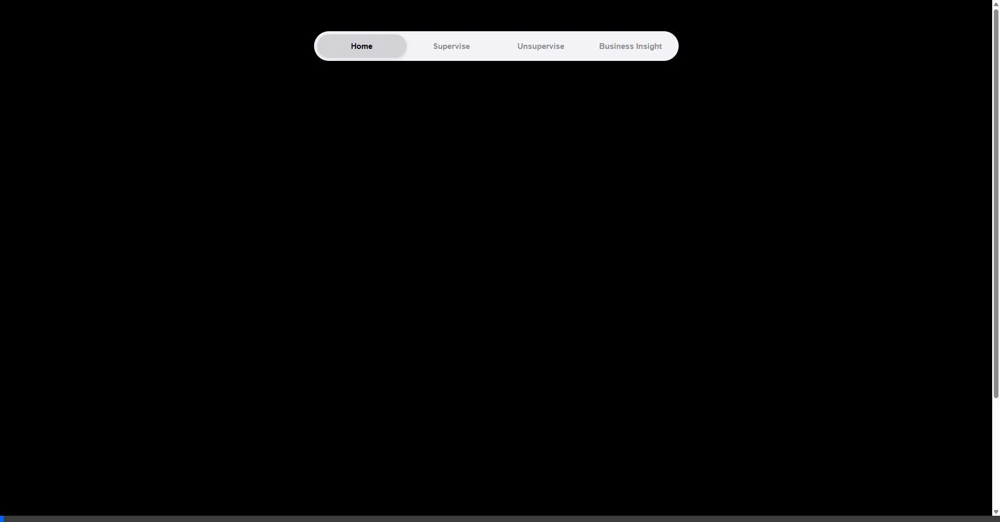

# Kiyora Analytics Dashboard (Web4Sub) 📊

**Kiyora Analytics Dashboard** เป็นโปรเจกต์เว็บแอปพลิเคชันสำหรับการวิเคราะห์ข้อมูลและแสดงผลข้อมูลเชิงลึก (Business Insight) รวมถึงการประยุกต์ใช้โมเดล Machine Learning (Supervised & Unsupervised Learning) ในรูปแบบ Dashboard ที่สวยงาม (Vibrant & Dark-themed) เพื่อช่วยให้แบรนด์ Kiyora สามารถวิเคราะห์พฤติกรรมลูกค้าและคาดการณ์ทิศทางธุรกิจได้อย่างแม่นยำ

---

## 🎥 สาธิตการทำงาน (Demo)



---

## 🏗️ โครงสร้างโปรเจกต์ (Project Structure)

โปรเจกต์ถูกแบ่งออกเป็น Frontend, Backend และระบบ Machine Learning อย่างเป็นสัดส่วน ดังนี้:

```text
4eves/
├── backend/                  # ส่วนจัดการ API และฐานข้อมูล
│   ├── main.py               # FastAPI Server หลัก จัดการ Endpoints
│   ├── database.py           # ฟังก์ชันสำหรับเชื่อมต่อและดึงข้อมูลจาก SQLite
│   └── survey.db             # ฐานข้อมูล SQLite เก็บข้อมูลแบบสอบถาม/ลูกค้า
├── frontend/                 # ส่วนหน้าบ้าน UI/UX
│   ├── index.html            # หน้า Home หลัก
│   ├── global.css            # ไฟล์ CSS หลักสำหรับดีไซน์
│   ├── home.js               # JavaScript สำหรับจัดการการแสดงผลหน้า Home
│   ├── Business-Insight.html # หน้า Business Insight Dashboard
│   ├── business-insight.css  # สไตล์สำหรับ Business Insight
│   ├── business-insight.js   # ลอจิกดึงข้อมูลแสดงผลแบบไดนามิก
│   ├── supervise.html        # หน้า Dashboard สำหรับ Supervised Learning
│   ├── supervise.css         # สไตล์สำหรับหน้า Supervised
│   ├── unsupervise.html      # หน้า Dashboard สำหรับ Unsupervised Learning
│   ├── unsupervise.css       # สไตล์สำหรับหน้า Unsupervised
│   └── unsupervise.js        # ลอจิกสำหรับดึงผลการวิเคราะห์ Unsupervised
├── models/                   # โมเดล Machine Learning ที่ผ่านการเทรน
│   ├── data/                 # ข้อมูลดิบและที่จัดการแล้ว
│   ├── images/               # รูปภาพกราฟต่างๆ จากโมเดล
│   ├── supervise/            # โค้ดและโมเดล Supervised (เช่น Logistic Regression)
│   └── unsupervise/          # โค้ดและโมเดล Unsupervised (K-Means, Isolation Forest)
├── requirements.txt          # รายการ Library ของ Python ที่ใช้
└── vercel.json               # ตั้งค่าการ Deploy ผ่าน Vercel (หากมี)
```

---

## 🔄 Workflow หลักการทำงาน

โครงสร้างการทำงานใช้สถาปัตยกรรมแบบ Client-Server Architecture โดยมี Flow ดังนี้:

```mermaid
graph TD;
    Client[Frontend: HTML/JS] -->|ส่ง HTTP Request| API[Backend: FastAPI];
    API --> DB[(SQLite: survey.db)];
    DB -->|คืนค่าชุดข้อมูล| API;
    API --> Model[Machine Learning Models];
    Model -->|คำนวณ/ทำนาย/วิเคราะห์| API;
    API -->|ส่งคืนผลลัพธ์เป็น JSON| Client;
    Client -->|อัปเดต UI ไดนามิก (DOM)| UI[แสดงผล Dashboard และกราฟ];
```

---

## 🧠 หลักการทำงาน (Architecture)

1. **Frontend (UI/UX):**
   - พัฒนาด้วย **Vanilla JS, HTML, และ CSS** ล้วนโดยไม่ได้พึ่งพาเฟรมเวิร์กใหญ่ๆ ทำให้โหลดไว
   - มีการแยกหน้าย่อยที่ชัดเจน ได้แก่ `Business-Insight` สำหรับ KPI และภาพรวมธุรกิจ, `Supervise` สำหรับการคาดการณ์ (Prediction) และการแสดง Metrics โมเดล, `Unsupervise` สำหรับการดู Clustering (K-Means) และ Anomaly Detection (Isolation Forest)
2. **Backend (API):**
   - ใช้ **FastAPI** เป็นหัวใจหลักในการสร้าง RESTful APIs
   - มีการทำ Endpoints สำหรับดึงข้อมูลภาพรวมธุรกิจ (`/api/business-insight`), การทำนายกลุ่มลูกค้า (`/api/predict`), และดึงผลลัพธ์จากโมเดล Unsupervised
3. **Database:**
   - ใช้ **SQLite** เป็นฐานข้อมูล โดยไฟล์ข้อมูลหลักคือ `survey.db` เพื่อดึงข้อมูลลูกค้า, ข้อมูลแบบสอบถาม นำมาคำนวณสถิติต่างๆ ใน Business Insight หน้า Dashboard
4. **Machine Learning:**
   - **Supervised Learning:** ใช้โมเดลต่างๆ เช่น `LogisticRegression` ในการประเมินและคาดการณ์พฤติกรรมลูกค้า (การตอบรับต่อโปรดักต์ใหม่)
   - **Unsupervised Learning:** ผสมผสานสองโมเดลคือ `K-Means Clustering` สำหรับจัดกลุ่มลูกค้าตามพฤติกรรม และ `Isolation Forest` สำหรับการตรวจจับความผิดปกติ (Anomaly Detection)

---

## 🚀 การติดตั้งและใช้งานเบื้องต้น (Quick Start)

### 1. การตั้งค่า Backend
รันเซิร์ฟเวอร์ด้วย FastAPI:
```cmd
cd backend
pip install -r ../requirements.txt
uvicorn main:app --reload
```
API จะเริ่มทำงานที่ `http://127.0.0.1:8000`

### 2. การเปิด Frontend
เปิดไฟล์ `index.html` หรือไฟล์หน้าอื่นๆ ในโฟลเดอร์ `frontend/` ผ่านบราวเซอร์ (แนะนำให้ใช้ Live Server extension ใน VS Code) หรือกำหนดพอร์ตแยก

---
